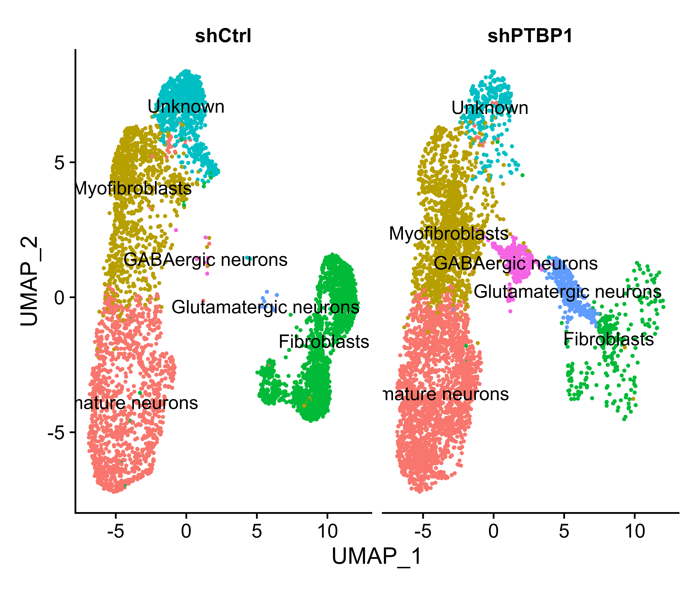
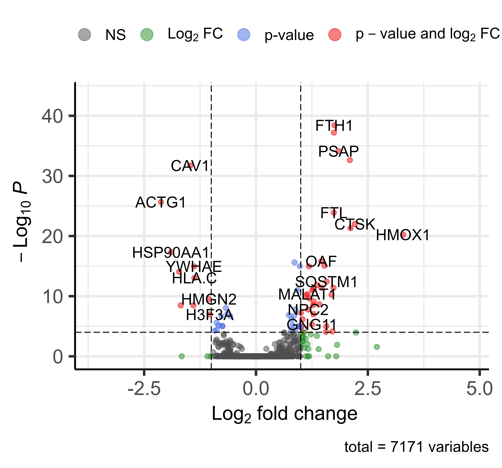
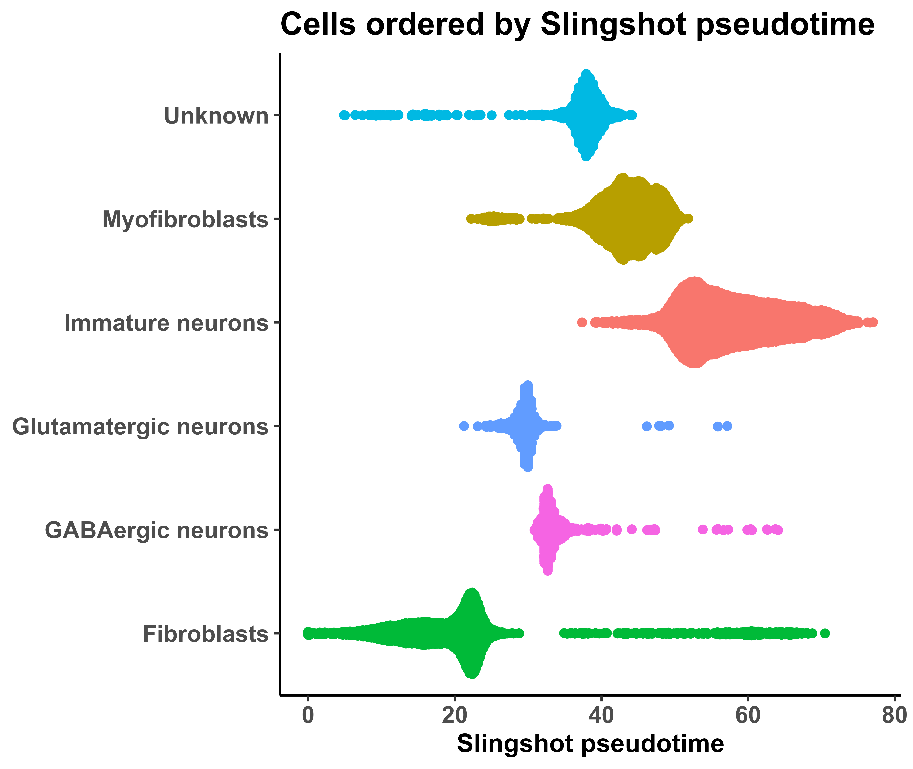
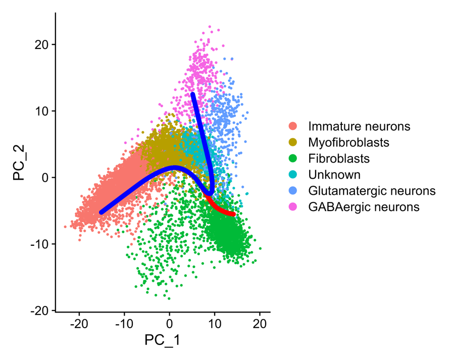

# Molecular characterization of directly reprogrammed neurons using single cell RNA sequencing

#### Do-Jin Seo1, Yoon-Ho Hong2,3,\*

1Department of Neurology, Seoul National University, Seoul, 03080, Republic of Korea. 2Department of Neurology, Medical Research Council, Seoul Metropolitan Government-Seoul National University Boramae Medical Center, Seoul, 07061, Republic of Korea. 3Neuroscience Research Institute, Seoul National University, Seoul, Republic of Korea.

## Abstract

Neurodegenerative disorders predominantly emerge sporadically, underscoring the necessity of modeling these conditions to advance therapeutic developments. We employed a method that entailed reducing PTBP1 expression in fibroblasts, which resulted in their conversion into neuronal cells with an approximate success rate of 20%. By employing single-cell RNA sequencing, we categorized the cell types and evaluated the gene expression disparities in neurons derived from fibroblasts. Most of the converted neurons were identified as either glutamatergic or GABAergic. Trajectory analysis revealed that the fibroblasts differentiated along two primary pathways, yielding neuron-like and myocyte-like cells. This study introduces a potentially novel approach for the direct reprogramming of human fibroblasts into neurons, signifying a significant advancement in the research and potential treatment of neurodegenerative diseases.

## Analysis scripts

store metadata.R

:   single cell RNAseq raw data load -\> QC, filter cells & features -\> normalization -\> scaling -\> clustering (PCA, UMAP), UMAP clustering -\> produce rds object

:   input files

    -   1129_neuron_SampleTag01_hs_empty_RSEC_MolsPerCell.csv

    -   1129_neuron_SampleTag02_hs_sh_RSEC_MolsPerCell.csv

:   output files

    -   seurat_object.rds

automatically assign cell types.R

:   meta data load -\> cluster annotation -\> produce annotation object, draw UMAP plot

    -   cells \<- brain (tissue type) \<- ScTypeDB_full \<- PanglaoDB, CellMarker database

    -   myofibroblast \<- all tissue \<- ScTypeDB_full \<- PanglaoDB, CellMarker database

    -   fibroblast \<- connective tissue \<- PanglaoDB

:   input files

    -   seurat_object.rds

    -   ScTypeDB_full.xlsx

        source: <https://github.com/IanevskiAleksandr/sc-type/>

:   output files

    -   annotation_object.rds

    -   UMAPplot.png

DE analysis.R

:   neural clusters vs. other clusters - DE assay & GO assay

:   input files

    -   annotation_object.rds

:   output files

    -   heatmap.png

    -   neuro.csv

    -   volcanoplot.png

 

20220509 sctype function-1.R, 20220509 sctype function-2.R

:   use ScType to automatically assign cell types : load two additional ScType functions.

Trajectory analysis.R

:   infer the differentiation trajectory of a set of cells

    input files

    -   annotation_object.rds

:   output files

    -   Cells_ordered_by_slingshot_pseudotime.png

    -   PCA_slingshotdata_line.png

 

## Data

[access data](https://drive.google.com/drive/folders/11PFSiti3EtbPt2UwwIpIlMXDQNfXhRNq)
